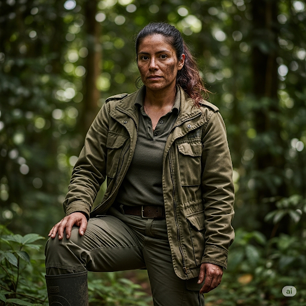

  
  

    <h4>Meet the Expert: <strong>Dr. Elena Vargas</strong></h4>
    

      <strong>Field Virologist & Ecologist</strong> 
      A rugged and relentless virus hunter affiliated with the Global Virome Project. Dr. Vargas spends most of her time in the world's most remote locations, tracking pathogens at the "interface" where wildlife and humans collide. Guided by the principles of One Health, she is a passionate advocate for the idea that environmental health is inseparable from human health. She is practical, grounded, and serves as the team's conscience, constantly reminding them of the real-world origins and consequences of the outbreak.
    

  

## Overview

The ecologist examines **organism-environment relationships** critical for understanding zoonotic disease emergence and spillover. This domain integrates wildlife population dynamics, biodiversity conservation, land use change impacts, and climate effects within the "One Health" paradigm that recognizes the interconnection of human, animal, and environmental health.

Approximately 75% of emerging infectious diseases are zoonotic, originating from animal reservoirs before spilling over to human populations. Understanding these ecological processes is essential not just for responding to pandemics, but for preventing them in the first place through ecosystem-based approaches that protect both biodiversity and human health.

## The Ecological Origins of Pandemics

**Spillover Interfaces:** Disease emergence typically occurs at interfaces where human activities bring people into contact with wildlife carrying novel pathogens. These interfaces are created by habitat fragmentation that increases human-wildlife contact frequency, biodiversity loss that reduces natural pathogen regulation mechanisms, wildlife trade networks that create novel species mixing opportunities, and climate-driven range shifts that bring new hosts and vectors into contact.

**Natural Protection:** Intact ecosystems provide multiple layers of protection against disease emergence. These include wildlife corridors that maintain natural host population structures, protected areas that minimize human encroachment and disturbance, sustainable land use practices that balance development with conservation, and biodiversity buffers that maintain the dilution effect against spillover.

<h3>Learning Objectives</h3>

By learning to embody this archetype, you will be able to:

<ol>
  <li><strong>Identify zoonotic spillover risk factors</strong> in different ecological contexts and geographic regions</li>
  <li><strong>Analyze biodiversity-disease relationships</strong> including dilution and amplification effects</li>
  <li><strong>Evaluate land use change impacts</strong> on pathogen emergence and transmission dynamics</li>
  <li><strong>Assess climate change effects</strong> on vector-borne disease distribution and seasonality</li>
  <li><strong>Apply One Health frameworks</strong> integrating human, animal, and environmental health considerations</li>
  <li><strong>Design ecological surveillance systems</strong> for early pandemic threat detection</li>
  <li><strong>Develop ecosystem-based interventions</strong> that provide co-benefits for conservation and health</li>
  <li><strong>Communicate ecological complexity</strong> to policy makers and public health professionals</li>
</ol>

## Key Challenges & Intersections

<h4>🏗️ vs. Built Environment Specialists</h4>

<strong>Challenge:</strong> Urban expansion and infrastructure development impact spillover risk at ecosystem boundaries where human settlements meet wildlife habitats.

<strong>Collaboration:</strong> Green infrastructure planning that protects wildlife corridors and reduces spillover interfaces while meeting human development needs.

<h4>💰 vs. Economists</h4>

<strong>Challenge:</strong> Conservation efforts compete with immediate economic development pressures and poverty alleviation needs in many spillover-prone regions.

<strong>Collaboration:</strong> Payment for ecosystem services schemes and sustainable development financing that value long-term pandemic prevention benefits.

<h4>🔬 vs. Biomedical Scientists</h4>

<strong>Challenge:</strong> Collaborative pathogen surveillance requires bridging veterinary and human health systems with different protocols and priorities.

<strong>Collaboration:</strong> Joint field research programs and shared pathogen databases that integrate wildlife, livestock, and human disease monitoring systems.

