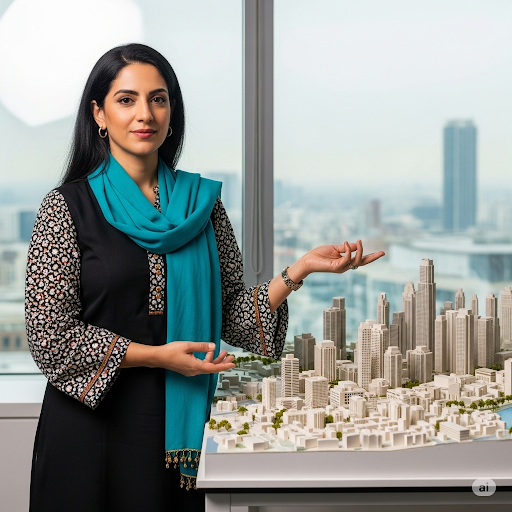

<!-- Hero Section -->

  

    <h1 class="hero-title">Pandemic Response Archetypes</h1>
    
Six Essential Perspectives for Understanding Global Health Crises

    

      
Pandemics are among the most complex challenges humanity faces, requiring expertise that spans biological sciences, social systems, economic structures, built environments, ecological networks, and information flows.

    

  

  
  

    
    
Our interdisciplinary team of pandemic response experts

  

<!-- Why These Domains Section -->
<section class="domains-explanation">
  <h2>Why These Six Domains?</h2>
  
These archetypes were selected based on critical knowledge gaps and coordination challenges revealed during recent pandemic responses, particularly COVID-19.

  
  

    

      
🔬

      <h3>The Scientific Foundation</h3>
      
<strong>Biomedical & Physical Scientists</strong> provide fundamental understanding of pathogens, disease mechanisms, and medical countermeasures.

    

    
    

      
🌿

      <h3>The Natural Origins</h3>
      
<strong>Ecologists</strong> help us understand that most pandemic threats emerge from disrupted human-animal-environment interfaces.

    

    
    

      
👥

      <h3>The Human Element</h3>
      
<strong>Socio-behavioral Scientists</strong> recognize that human behavior ultimately determines intervention success or failure.

    

    
    

      
💰

      <h3>The Economic Reality</h3>
      
<strong>Economists</strong> analyze massive financial disruptions and help balance health protection with economic sustainability.

    

    
    

      
🏙️

      <h3>The Physical Context</h3>
      
<strong>Built Environment Specialists</strong> understand how infrastructure design facilitates or inhibits disease transmission.

    

    
    

      
📱

      <h3>The Information Landscape</h3>
      
<strong>Information Access Specialists</strong> navigate digital ecosystems where accurate information competes with misinformation.

    

  

</section>

<!-- Expert Team Section -->
<section class="expert-team-section">
  <h2>Meet Our Expert Team</h2>
  
Each archetype is embodied by a fictional expert character who represents the mindset, approaches, and challenges of their respective domain.

  
  

    

      

        
        

          <i class="fas fa-microscope"></i>
        

      

      

        <h3>Dr. Beatrice Chen</h3>
        <h4>Biomedical & Physical Scientist</h4>
        
Lead Geneticist specializing in genomic epidemiology and pathogen tracking

        <a href="./biomedical" class="expert-link">
          <i class="fas fa-arrow-right"></i> Explore Archetype
        </a>
      

    

    
    

      

        
        

          <i class="fas fa-leaf"></i>
        

      

      

        <h3>Dr. Elena Vargas</h3>
        <h4>Ecologist</h4>
        
Field Virologist studying human-wildlife disease interfaces and One Health approaches

        <a href="./ecologist" class="expert-link">
          <i class="fas fa-arrow-right"></i> Explore Archetype
        </a>
      

    

    
    

      

        
        

          <i class="fas fa-users"></i>
        

      

      

        <h3>Simone Dubois</h3>
        <h4>Socio-behavioral Scientist</h4>
        
Behavioral Scientist focusing on mass psychology and information dynamics

        <a href="./socio-behavioral" class="expert-link">
          <i class="fas fa-arrow-right"></i> Explore Archetype
        </a>
      

    

    
    

      

        
        

          <i class="fas fa-chart-line"></i>
        

      

      

        <h3>Liz Jones</h3>
        <h4>Economist</h4>
        
Biotech Financier and Logistical Strategist analyzing economic systems

        <a href="./economist" class="expert-link">
          <i class="fas fa-arrow-right"></i> Explore Archetype
        </a>
      

    

    
    

      

        
        

          <i class="fas fa-city"></i>
        

      

      

        <h3>Dr. Bisma Khan</h3>
        <h4>Built Environment Specialist</h4>
        
Urban Systems Expert designing resilient infrastructure and healthy environments

        <a href="./built-environment" class="expert-link">
          <i class="fas fa-arrow-right"></i> Explore Archetype
        </a>
      

    

    
    

      

        
        

          <i class="fas fa-broadcast-tower"></i>
        

      

      

        <h3>Izzy Rossi</h3>
        <h4>Information Access Specialist</h4>
        
Data Scientist tracking information flows and combating misinformation

        <a href="./information-access" class="expert-link">
          <i class="fas fa-arrow-right"></i> Explore Archetype
        </a>
      

    

  

</section>

<!-- Framework Section -->
<section class="framework-section">
  <h2>A Framework, Not a Limitation</h2>
  

    

      
<strong>This is one way to organize pandemic expertise</strong>, not the only way. The real world of pandemic preparedness includes many other critical roles:

      
      

        

          <h4>🔢 Quantitative Specialists</h4>
          
Mathematicians, statisticians, AI/ML specialists, and UX/UI experts

        

        

          <h4>🏥 Healthcare Professionals</h4>
          
Public health officials, healthcare workers, and mental health professionals

        

        

          <h4>🌍 System Coordinators</h4>
          
Emergency managers, international relations experts, and supply chain specialists

        

        

          <h4>⚖️ Governance & Ethics</h4>
          
Legal experts, ethicists, and community leaders

        

      

    

  

</section>

<!-- Usage Guide -->
<section class="usage-section">
  <h2>How to Use These Archetypes</h2>
  

    

      
📚

      <h3>For Students</h3>
      
Explore pandemic studies through structured pathways that connect different disciplines

    

    

      
💼

      <h3>For Professionals</h3>
      
Develop interdisciplinary skills and understand how your expertise connects to others

    

    

      
🏛️

      <h3>For Policy Makers</h3>
      
Understand different expert perspectives and coordinate across professional boundaries

    

    

      
🔬

      <h3>For Researchers</h3>
      
Find collaboration opportunities and understand interdisciplinary research challenges

    

  

</section>

<!-- Call to Action -->

  <h2>Ready to Explore?</h2>
  
Choose an archetype to begin your journey into pandemic preparedness expertise

  

    <a href="./biomedical" class="cta-button primary">Start with Science</a>
    <a href="./ecologist" class="cta-button secondary">Explore Ecology</a>
    <a href="#expert-team-section" class="cta-button tertiary">View All Experts</a>
  

  
<em>Remember: Pandemics are fundamentally interdisciplinary challenges. The most effective responses emerge when experts from different domains can communicate across their boundaries and integrate their unique perspectives into coordinated action.</em>

